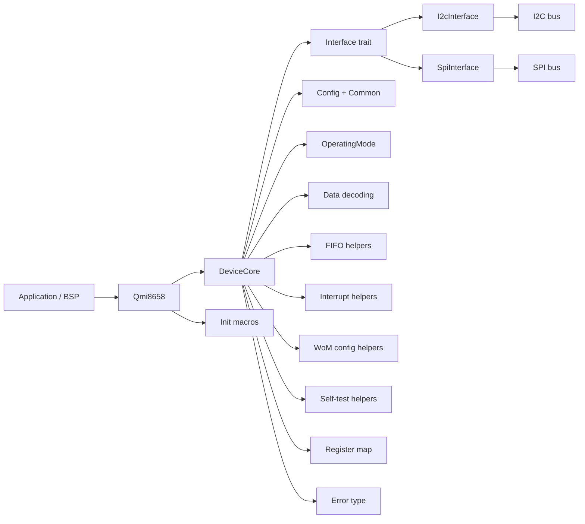
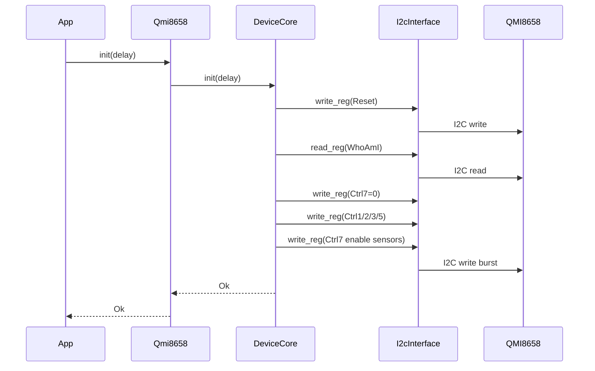
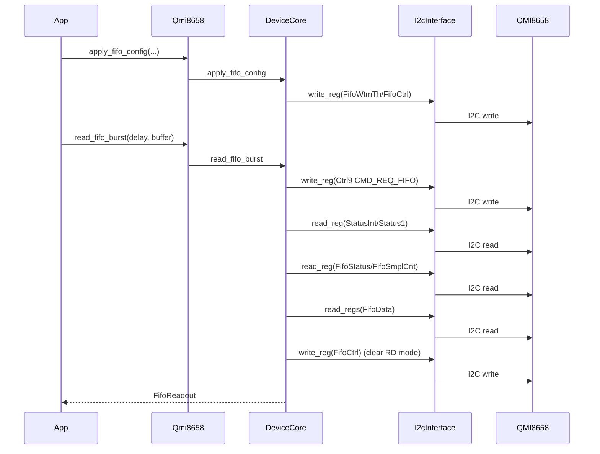
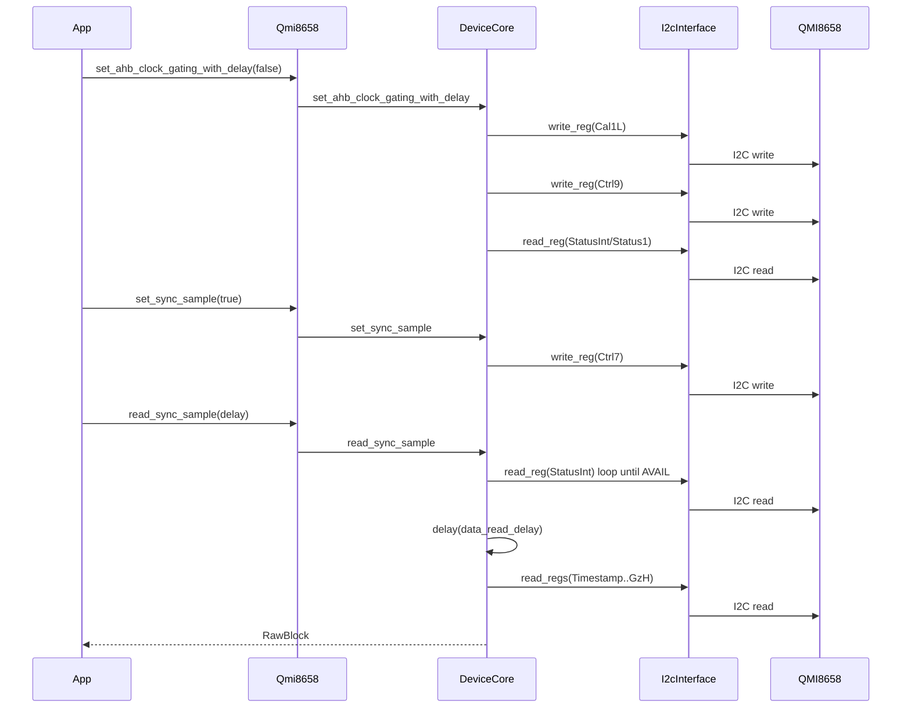
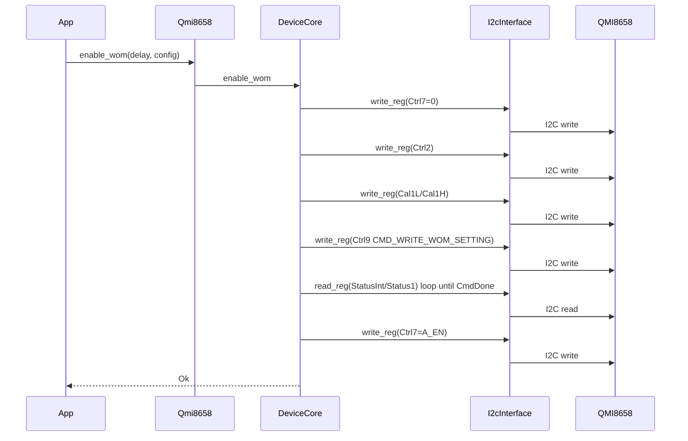

# QMI8658 Driver Architecture

This document describes the driver structure, responsibilities, and data flow
as implemented in `crates/qmi8658`.

## Overview
- `Qmi8658` is the public API surface and owns optional INT1/INT2 pins.
- `DeviceCore` owns register I/O, configuration application, mode transitions,
  and core read paths.
- `Interface` abstracts register access; `I2cInterface` and `SpiInterface` are
  adapters over transport buses.
- `InterfaceSettings` controls CTRL1 flags (auto-increment, endianness, SPI mode).
- Pure modules (`config`, `mode`, `data`, `fifo`, `interrupt`, `wom`, `self_test`,
  `register`, `error`) keep packing/decoding logic isolated from transport.
- `macros` provides helper macros such as `qmi8658_init_sequence!` to reduce
  boilerplate in common init flows.

## Module map

## Init flow (base)

## Init sequence macro flow
`qmi8658_init_sequence!` expands a common sequence:
- `init_with_addresses`
- `apply_interrupt_config`
- `set_config` + `apply_config`
- Optional FIFO config + FIFO reset

## FIFO read flow (burst)

## Sync sample read flow

## Wake on Motion flow

## FIFO parsing helpers
`FifoFrame`, `FifoFrameIterator`, and `MagRaw` are part of the public API and
intended for burst FIFO consumption.
