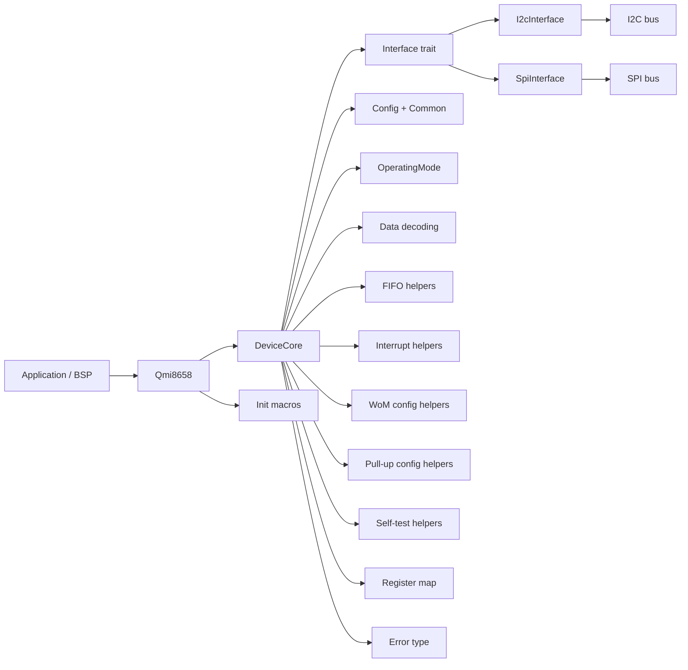
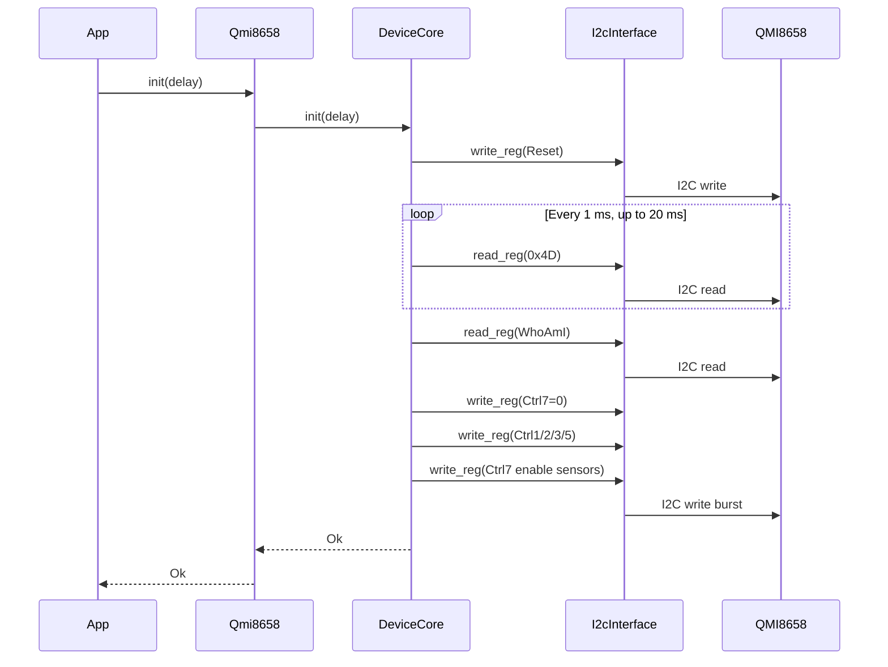
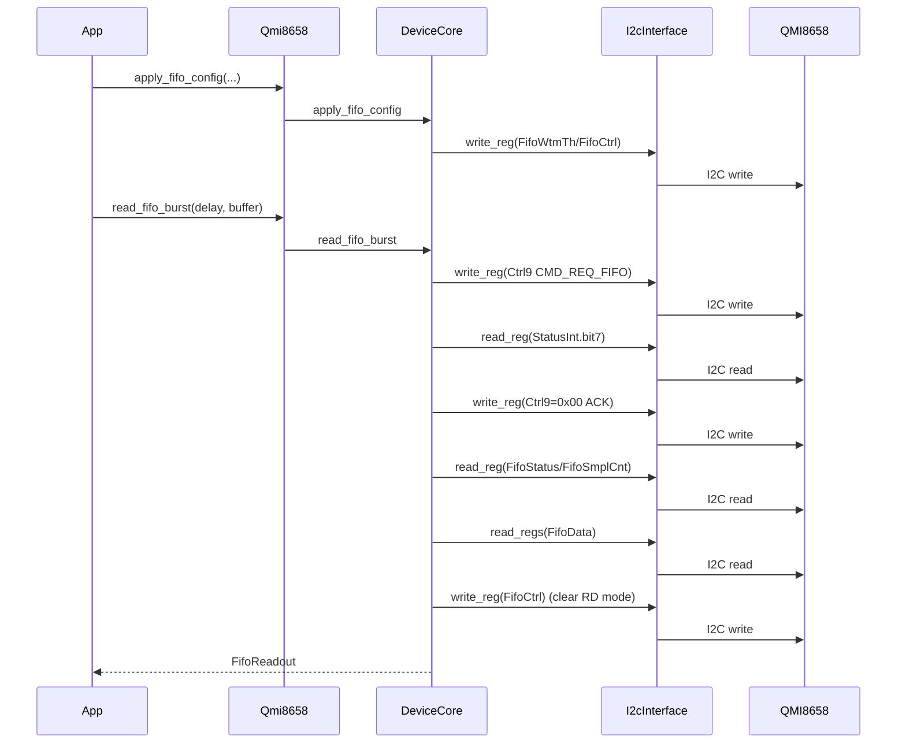
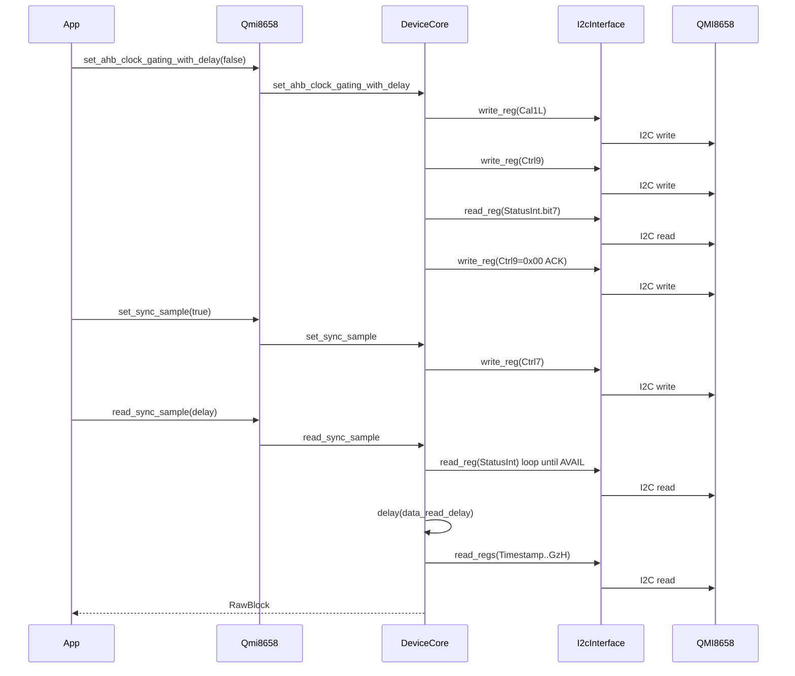
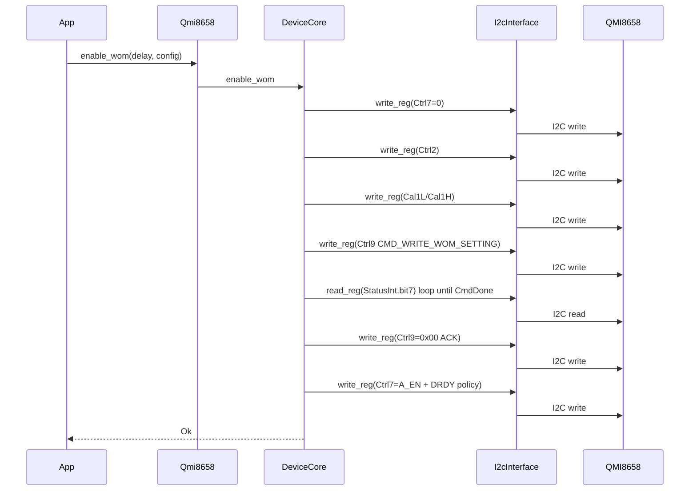

# QMI8658 Driver Architecture

This document describes the driver structure, responsibilities, and data flow
as implemented in `crates/qmi8658`.

## Overview
- `Qmi8658` is the public API surface and owns optional INT1/INT2 pins.
- `DeviceCore` owns register I/O, configuration application, mode transitions,
  and core read paths.
- `Interface` abstracts register access; `I2cInterface` and `SpiInterface` are
  adapters over transport buses.
- `InterfaceSettings` controls CTRL1 flags (auto-increment, endianness, SPI mode).
- Cargo features select the CTRL1 layout: QMI8658A exposes INT1/INT2 output
  enables, while QMI8658C treats bits 4–3 as reserved.
- `DeviceCore` retains DRDY as private policy and composes every active CTRL7
  value from sensor enables, SyncSample state, and that policy.
- Pure modules (`config`, `mode`, `data`, `fifo`, `interrupt`, `wom`, `self_test`,
  `pull`, `register`, `error`) keep packing/decoding logic isolated from transport.
- `macros` provides helper macros such as `qmi8658_init_sequence!` to reduce
  boilerplate in common init flows.

## Module map

```mermaid
graph LR
  App[Application / BSP] --> Driver[Qmi8658]
  Driver --> Core[DeviceCore]
  Core --> Interface[Interface trait]
  Interface --> I2cI[I2cInterface]
  Interface --> SpiI[SpiInterface]
  I2cI --> Bus[I2C bus]
  SpiI --> SpiBus[SPI bus]

  Core --> Config[Config + Common]
  Core --> Mode[OperatingMode]
  Core --> Data[Data decoding]
  Core --> Fifo[FIFO helpers]
  Core --> Interrupt[Interrupt helpers]
  Core --> WoM[WoM config helpers]
  Core --> Pull[Pull-up config helpers]
  Core --> SelfTest[Self-test helpers]
  Core --> Register[Register map]
  Core --> Error[Error type]

  Driver --> Macros[Init macros]
```

## Init flow (base)

```mermaid
sequenceDiagram
  participant App
  participant Driver as Qmi8658
  participant Core as DeviceCore
  participant Bus as I2cInterface
  participant Dev as QMI8658

  App->>Driver: init(delay)
  Driver->>Core: init(delay)
  Core->>Bus: write_reg(Reset)
  Bus->>Dev: I2C write
  loop Every 1 ms, up to 20 ms
    Core->>Bus: read_reg(0x4D)
    Bus->>Dev: I2C read
  end
  Core->>Bus: read_reg(WhoAmI)
  Bus->>Dev: I2C read
  Core->>Bus: write_reg(Ctrl7=0)
  Core->>Bus: write_reg(Ctrl1/2/3/5)
  Core->>Bus: write_reg(Ctrl7 enable sensors)
  Bus->>Dev: I2C write burst
  Core-->>Driver: Ok
  Driver-->>App: Ok
```

## Init sequence macro flow
`qmi8658_init_sequence!` expands a common sequence:
- `init_with_addresses`
- `apply_interrupt_config`
- `set_config` + `apply_config`
- Optional FIFO config + FIFO reset

## FIFO read flow (burst)

```mermaid
sequenceDiagram
  participant App
  participant Driver as Qmi8658
  participant Core as DeviceCore
  participant Bus as I2cInterface
  participant Dev as QMI8658

  App->>Driver: apply_fifo_config(...)
  Driver->>Core: apply_fifo_config
  Core->>Bus: write_reg(FifoWtmTh/FifoCtrl)
  Bus->>Dev: I2C write

  App->>Driver: read_fifo_burst(delay, buffer)
  Driver->>Core: read_fifo_burst
  Core->>Bus: write_reg(Ctrl9 CMD_REQ_FIFO)
  Bus->>Dev: I2C write
  Core->>Bus: read_reg(StatusInt.bit7)
  Bus->>Dev: I2C read
  Core->>Bus: write_reg(Ctrl9=0x00 ACK)
  Bus->>Dev: I2C write
  Core->>Bus: read_reg(FifoStatus/FifoSmplCnt)
  Bus->>Dev: I2C read
  Core->>Bus: read_regs(FifoData)
  Bus->>Dev: I2C read
  Core->>Bus: write_reg(FifoCtrl) (clear RD mode)
  Bus->>Dev: I2C write
  Core-->>App: FifoReadout
```

## Sync sample read flow

```mermaid
sequenceDiagram
  participant App
  participant Driver as Qmi8658
  participant Core as DeviceCore
  participant Bus as I2cInterface
  participant Dev as QMI8658

  App->>Driver: set_ahb_clock_gating_with_delay(false)
  Driver->>Core: set_ahb_clock_gating_with_delay
  Core->>Bus: write_reg(Cal1L)
  Bus->>Dev: I2C write
  Core->>Bus: write_reg(Ctrl9)
  Bus->>Dev: I2C write
  Core->>Bus: read_reg(StatusInt.bit7)
  Bus->>Dev: I2C read
  Core->>Bus: write_reg(Ctrl9=0x00 ACK)
  Bus->>Dev: I2C write

  App->>Driver: set_sync_sample(true)
  Driver->>Core: set_sync_sample
  Core->>Bus: write_reg(Ctrl7)
  Bus->>Dev: I2C write

  App->>Driver: read_sync_sample(delay)
  Driver->>Core: read_sync_sample
  Core->>Bus: read_reg(StatusInt) loop until AVAIL
  Bus->>Dev: I2C read
  Core->>Core: delay(data_read_delay)
  Core->>Bus: read_regs(Timestamp..GzH)
  Bus->>Dev: I2C read
  Core-->>App: RawBlock
```

## Wake on Motion flow

```mermaid
sequenceDiagram
  participant App
  participant Driver as Qmi8658
  participant Core as DeviceCore
  participant Bus as I2cInterface
  participant Dev as QMI8658

  App->>Driver: enable_wom(delay, config)
  Driver->>Core: enable_wom
  Core->>Bus: write_reg(Ctrl7=0)
  Bus->>Dev: I2C write
  Core->>Bus: write_reg(Ctrl2)
  Bus->>Dev: I2C write
  Core->>Bus: write_reg(Cal1L/Cal1H)
  Bus->>Dev: I2C write
  Core->>Bus: write_reg(Ctrl9 CMD_WRITE_WOM_SETTING)
  Bus->>Dev: I2C write
  Core->>Bus: read_reg(StatusInt.bit7) loop until CmdDone
  Bus->>Dev: I2C read
  Core->>Bus: write_reg(Ctrl9=0x00 ACK)
  Bus->>Dev: I2C write
  Core->>Bus: write_reg(Ctrl7=A_EN + DRDY policy)
  Bus->>Dev: I2C write
  Core-->>App: Ok
```

## FIFO parsing helpers
`FifoFrame`, `FifoFrameIterator`, and `MagRaw` are part of the public API and
intended for burst FIFO consumption.

## CTRL9 command policy

All command paths use STATUSINT.bit7 as CmdDone regardless of CTRL8.bit7.
CTRL8.bit7 only determines whether the external INT1 handshake is asserted.
Successful waits write the `0x00` acknowledgement; timeouts do not acknowledge,
so callers can inspect or retry. Normal commands use a 100 ms poll limit and
on-demand calibration uses 2 seconds.

## Variant and compatibility policy

- `qmi8658c` is the default feature and no selected variant falls back to the
  same behavior for v0.1.x compatibility.
- `qmi8658a` and `qmi8658c` cannot be enabled together.
- QMI8658A-only public builders are compiled only with `qmi8658a`.
- QMI8658B is not represented until an official datasheet is reviewed.
- Public `Config` and `Error` retain their v0.1.1 shapes; new runtime policy is
  held privately by `DeviceCore`.
